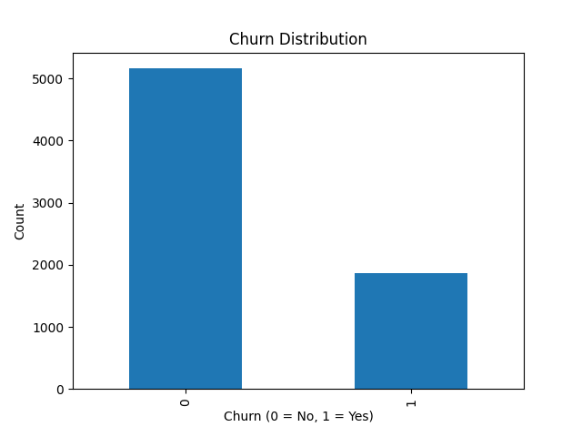
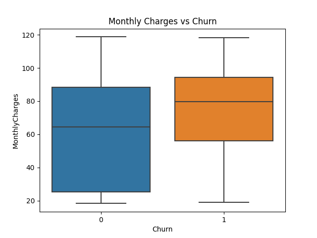
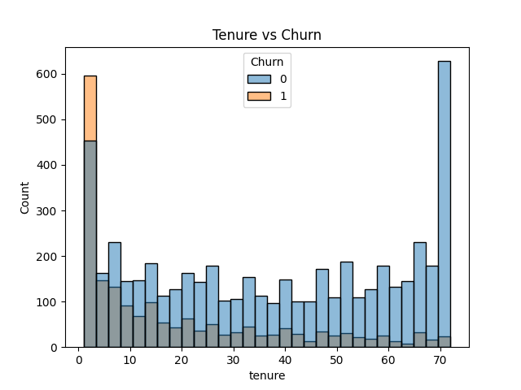

#  Customer Churn Analysis

##  Objective
The goal of this project is to analyze customer churn behavior and build a predictive model to identify customers who are likely to leave a telecom service.

---

##  Dataset
- Telco Customer Churn Dataset  
- Contains information about ~7,000 customers  
- Includes features like tenure, monthly charges, contract type, and services used  

---

##  Tools & Technologies
- Python  
- Pandas  
- NumPy  
- Matplotlib / Seaborn  
- Scikit-learn  

---

##  Exploratory Data Analysis (EDA)

Key observations:
- Customers with low tenure are more likely to churn  
- Month-to-month contracts show higher churn rates  
- Higher monthly charges correlate with higher churn  

## Visualizations

### Churn Distribution

### Monthly Charges vs Churn

### Tenure vs Churn

## Model Building
- Model used: Random Forest Classifier  
- Reason: Handles feature importance well and performs robustly  

---

## Model Performance
- Accuracy: 80.4%  
- ROC-AUC Score: 0.84
- Key Features:
  - Tenure  
  - Monthly Charges  
  - Contract Type  

- Algorithm: Logistic Regression
- Accuracy: ~79%

### Classification Report:
- Precision (Churn=1): 0.64
- Recall (Churn=1): 0.49
- F1-score: 0.56

 ## Dashboard

Power BI dashboard analyzing customer churn.

### Features:
- KPI cards (Total Customers, Churn Rate, Avg Charges)
- Churn by Contract, Gender, Payment Method
- Customer behavior analysis (Tenure, Charges)

### Key Insights:
- Month-to-month customers have highest churn
- High charges increase churn probability
- Low tenure customers churn more

## Business Insights
- Focus on retaining new customers (low tenure)  
- Offer incentives for long-term contracts  
- Monitor customers with high monthly charges  

---

## Conclusion
This project demonstrates how machine learning can be used to predict customer churn and generate actionable business insights to improve customer retention.

---

## 📁 Project Structure

customer-churn-analysis/
│
├── data/
│ └── churn_data.csv
│
├── notebooks/
│ └── churn_analysis.ipynb
│
├── src/
│ ├── model.py
│ └── churn_plot.py
│
├── images/
│ ├── churn_distribution.png
│ ├── monthly_charges.png
│ └── tenure.png
│
├── dashboard/
│ └── churn_dashboard.pbix
│
└── README.md
